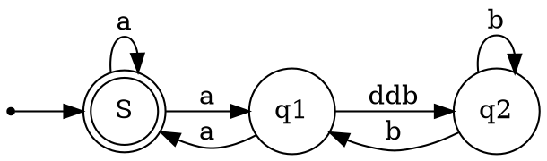

```
 _____ ______   ________  ________  ___  __            ________  ________  ___       __   ________
|\   _ \  _   \|\   __  \|\   __  \|\  \|\  \         |\   ___ \|\   __  \|\  \     |\  \|\   ___  \
\ \  \\\__\ \  \ \  \|\  \ \  \|\  \ \  \/  /|_       \ \  \_|\ \ \  \|\  \ \  \    \ \  \ \  \\ \  \
 \ \  \\|__| \  \ \   __  \ \   _  _\ \   ___  \       \ \  \ \\ \ \  \\\  \ \  \  __\ \  \ \  \\ \  \
  \ \  \    \ \  \ \  \ \  \ \  \\  \\ \  \\ \  \       \ \  \_\\ \ \  \\\  \ \  \|\__\_\  \ \  \\ \  \
   \ \__\    \ \__\ \__\ \__\ \__\\ _\\ \__\\ \__\       \ \_______\ \_______\ \____________\ \__\\ \__\
    \|__|     \|__|\|__|\|__|\|__|\|__|\|__| \|__|        \|_______|\|_______|\|____________|\|__| \|__|

```
自动生成目录
<!-- TOC -->

- [一级标题](#一级标题)
    - [二级标题](#二级标题)
        - [三级标题](#三级标题)
            - [四级标题](#四级标题)
                - [五级标题](#五级标题)
                    - [六级标题](#六级标题)
- [字体样式](#字体样式)
- [Latex 数学公式](#latex-数学公式)
- [表格](#表格)
- [文本中插入代码](#文本中插入代码)
    - [行内插入代码](#行内插入代码)
    - [插入代码块](#插入代码块)
- [超链接](#超链接)
    - [行内式](#行内式)
        - [无悬停说明](#无悬停说明)
        - [有悬停说明](#有悬停说明)
    - [参考式](#参考式)
    - [自动链接](#自动链接)
    - [脚注](#脚注)
- [列表](#列表)
- [插入引用](#插入引用)
- [check box](#check-box)
- [转移字符](#转移字符)
- [文字色彩 底色](#文字色彩-底色)
- [简单绘图](#简单绘图)
- [插入图片](#插入图片)
- [emoji](#emoji)

<!-- /TOC -->

:rose:
设置页面颜色，段落颜色
<style>
    body { background-color:#F0EAD6; }
    p { background-color:#FFFAF0; }
</style>
***
最多6级标题，插件自动生成目录。

# 一级标题

## 二级标题

### 三级标题

#### 四级标题

##### 五级标题

###### 六级标题

***

# 字体样式
不粗与**粗体**

不斜与_斜体_

不划与~~划线~~

# Latex 数学公式

$$\sum_{i=1}^n a_i=0$$
***
$$f(x_1,x_x,\ldots,x_n) = x_1^2 + x_2^2 + \cdots + x_n^2 $$
***
$$\sum^{j-1}_{k=0}{\widehat{\gamma}_{kj} z_k}$$

# 表格

| Column A | Column B | Column C |
| -------- | -------- | -------- |
| A1       | B1       | C1       |
| A2       | B2       | C2       |
| A3       | B3       | C3       |

# 文本中插入代码

## 行内插入代码

第一个 `printf()`

## 插入代码块

前后3个\` 加语言类型，漂亮

```C
#include <stdio.h>

int main(void){
    printf("Hello world\n");
}
```

# 超链接

## 行内式

### 无悬停说明

超链接[点我](foo.nidedizhi.bar)

### 有悬停说明

超链接[点我](foo.nidedizhi.bar "鼠标悬停你会看到我！")

## 参考式

problem [stack overflow][1]
funny video go to [youtube][2]

[1]: www.stack.com "hover?"

[2]: www.you.com "hover?"

## 自动链接

<http://example.com/>

<mailto:address@example.com>

## 脚注
vscode[^1] is great.
vulkan[^2] is nice.

[^1]: from MS

[^2]: Apple sucks.


# 列表

 \*，+，-

-   圆点
-   圆点

1.  1st
2.  2nd
3.  3rd

# 插入引用

> > > 请问 Markdwon 怎么用？ - 小白
> >
> > 自己看教程！ - 愤青
>
> 教程在哪？ - 小白


# check box
- [ ] asterisk

- [x] ~~_minus_~~

- [x] ~~_plus_~~

# 转移字符


\\   反斜线

\`   反引号

\*   星号

\_   底线

\{}  花括号

\[]  方括号

\()  括弧

\#   井字号

\+   加号

\-   减号

\.   英文句点

\!   惊叹号

# 文字色彩 底色
Some Markdown text with <span style="color:blue">some _blue_ text</span>.

<p style='color:red'>This is some red text.</p>
<font color="red">This is some text!</font>
These are <b style='color:red'>red words</b>.

<span style="background-color: #FFFF00">Marked text</span>

<p style="background-color: #FFFF00">This complete paragraph of text is highlighted in yellow.</p>

# 简单绘图


# 插入图片


# emoji
👍
:8ball:
💕
⚒